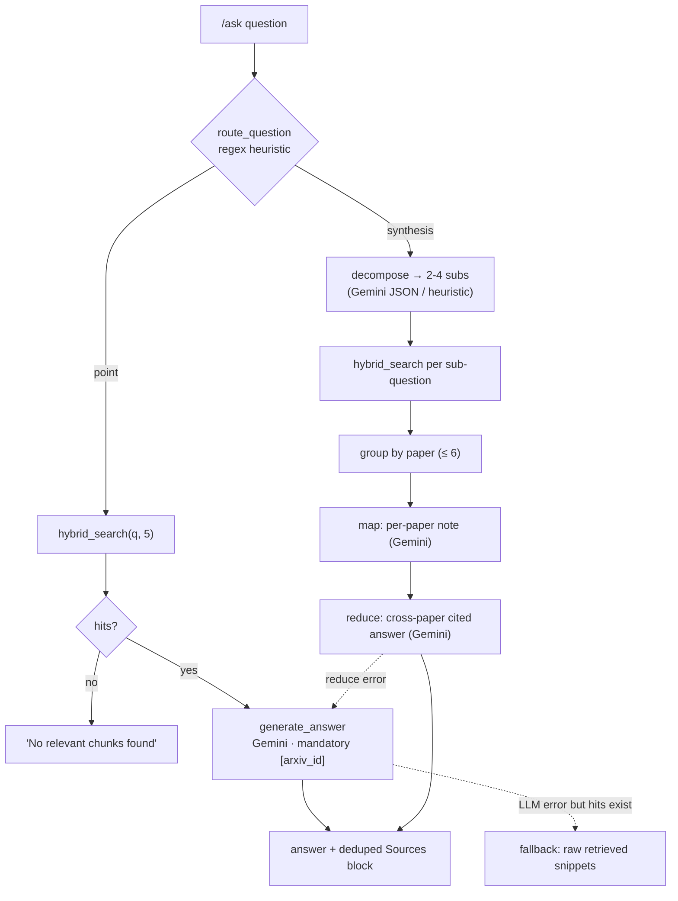

# Ask flow — routing, hybrid retrieval, synthesis

🇷🇺 [Русская версия](ask-flow.ru.md)

`/ask` from question to cited answer. Prose in [../retrieval.md](../retrieval.md).

- **Ready-only**: every `hybrid_search` filters `ingest_status = 'indexed'`.
- **Dense + full-text** are fused by RRF inside `hybrid_search`; only the dense leg needs a Gemini
  query embedding.
- **Sources** are deduped by `arxiv_id` and rendered as `arxiv.org/abs/{id}` under the answer.
