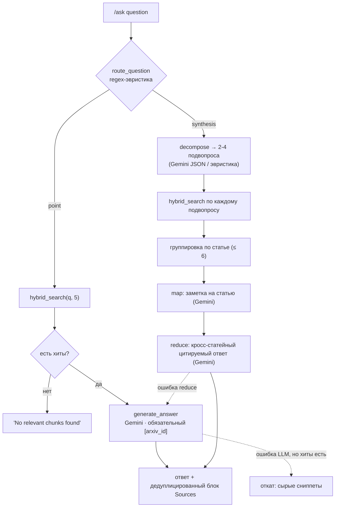

# Поток ask — роутинг, hybrid retrieval, синтез

🇬🇧 [English version](ask-flow.md)

`/ask` от вопроса до цитируемого ответа. Проза в [../retrieval.ru.md](../retrieval.ru.md).

- **Ready-only**: каждый `hybrid_search` фильтрует `ingest_status = 'indexed'`.
- **Dense + full-text** сливаются через RRF внутри `hybrid_search`; только dense-ветке нужен
  эмбеддинг запроса от Gemini.
- **Sources** дедуплицируются по `arxiv_id` и рендерятся как `arxiv.org/abs/{id}` под ответом.
