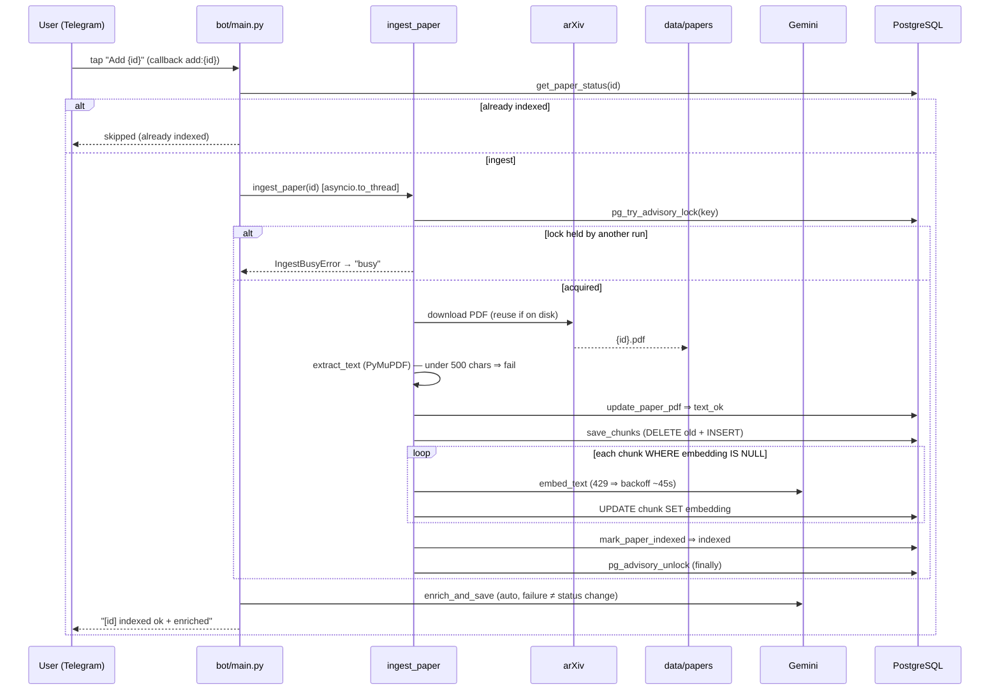

# Ingest flow — `Add` button to `indexed`

🇷🇺 [Русская версия](ingest-flow.ru.md)

One paper from the inline `Add` button to `indexed`, then auto-enrichment. Prose in
[../ingest-pipeline.md](../ingest-pipeline.md).

- **Failure before `indexed`** ⇒ caller runs `mark_paper_failed` (safe error); the PDF stays on
  disk. `IngestBusyError` is reported as "busy", not a failure.
- **`/reindex`** enters the same `ingest_paper` sequence after `prepare_reindex` resets a
  `pending` / `text_ok` / `failed` paper to `pending` (never `indexed`).
