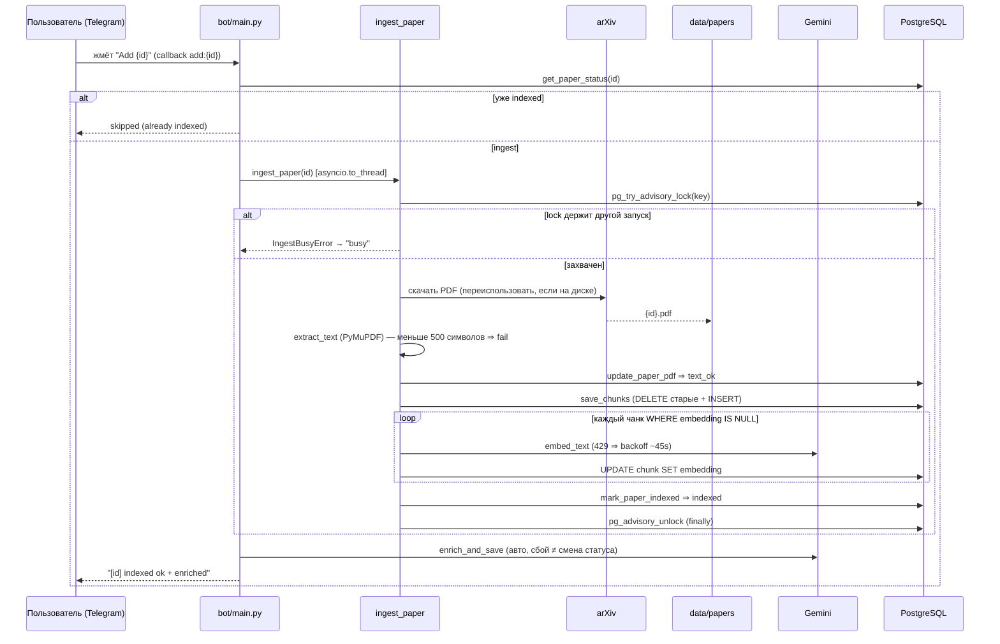

# Поток ingest — от кнопки `Add` до `indexed`

🇬🇧 [English version](ingest-flow.md)

Одна статья от inline-кнопки `Add` до `indexed`, затем авто-enrichment. Проза в
[../ingest-pipeline.ru.md](../ingest-pipeline.ru.md).

- **Сбой до `indexed`** ⇒ вызывающий код запускает `mark_paper_failed` (безопасная ошибка); PDF
  остаётся на диске. `IngestBusyError` репортится как "busy", не failure.
- **`/reindex`** входит в ту же последовательность `ingest_paper` после того, как `prepare_reindex`
  сбрасывает `pending` / `text_ok` / `failed` статью в `pending` (никогда не `indexed`).
