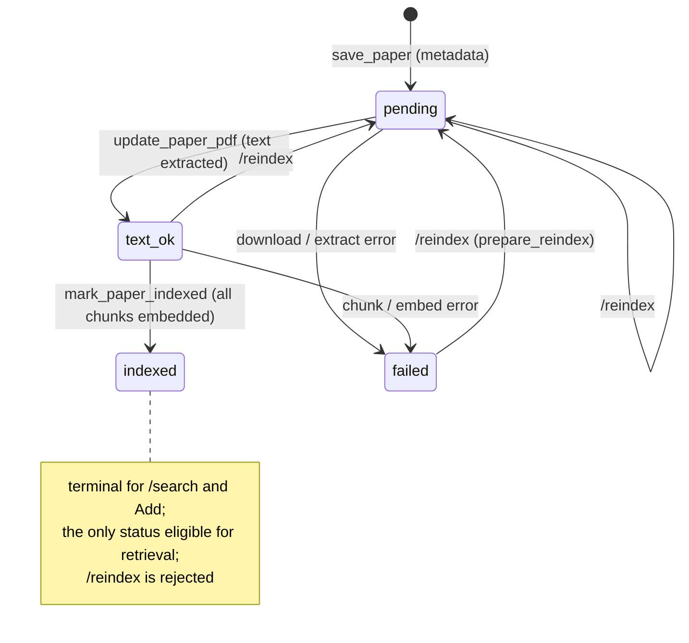

# Paper lifecycle — `ingest_status`

🇷🇺 [Русская версия](paper-lifecycle.ru.md)

The `ingest_status` state machine. Prose in [../ingest-pipeline.md](../ingest-pipeline.md).

- **Ready-only retrieval.** `search_chunks` / `full_text_search` only read `indexed` papers.
- **Recovery is explicit.** `/reindex` accepts `pending` / `text_ok` / `failed` and resets to
  `pending`; `indexed` is rejected so a working index is never silently rebuilt.
- **Legacy backfill** ([backfill_ingest_lifecycle.sql](../../scripts/backfill_ingest_lifecycle.sql)):
  pre-existing `text_ok` rows with ≥1 chunk and no null embedding → `indexed`; otherwise → `failed`.
  The local PDF is retained through every transition.
