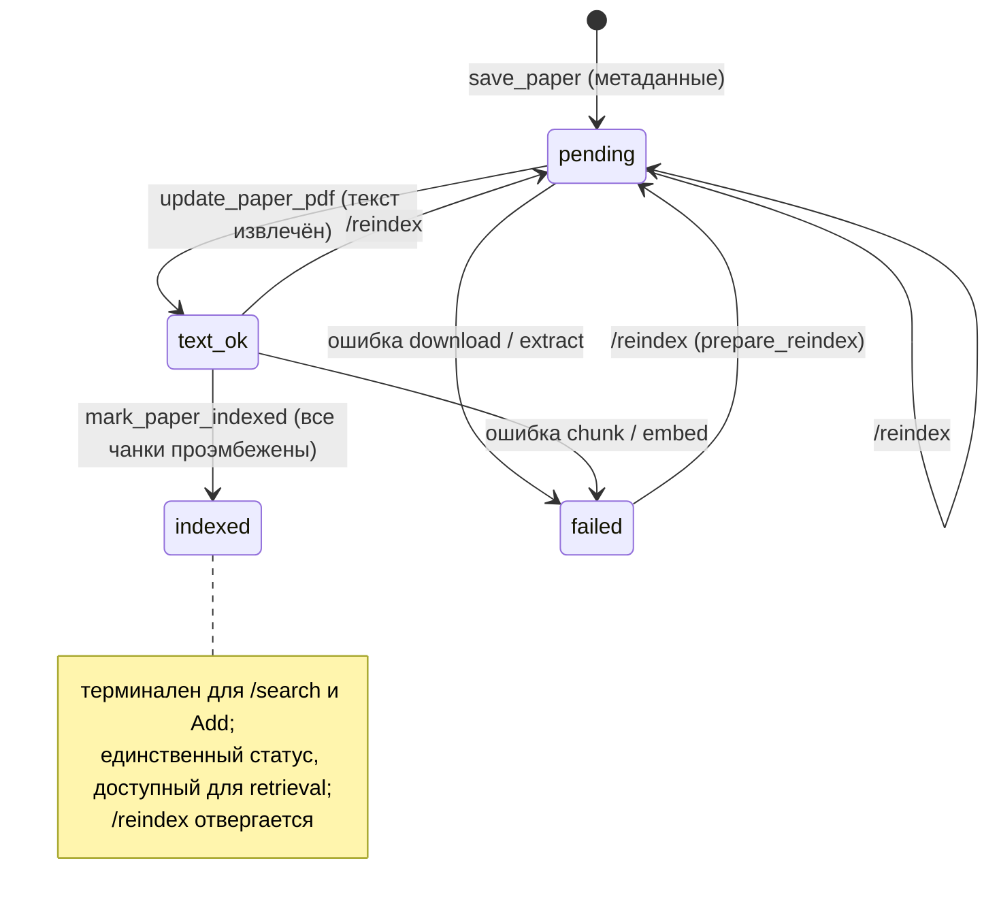

# Lifecycle статьи — `ingest_status`

🇬🇧 [English version](paper-lifecycle.md)

Машина состояний `ingest_status`. Проза в [../ingest-pipeline.ru.md](../ingest-pipeline.ru.md).

- **Ready-only retrieval.** `search_chunks` / `full_text_search` читают только `indexed` статьи.
- **Восстановление явное.** `/reindex` принимает `pending` / `text_ok` / `failed` и сбрасывает в
  `pending`; `indexed` отвергается, чтобы рабочий индекс не пересобирался молча.
- **Legacy backfill** ([backfill_ingest_lifecycle.sql](../../scripts/backfill_ingest_lifecycle.sql)):
  существующие `text_ok` строки с ≥1 чанком и без null-эмбеддингов → `indexed`; иначе → `failed`.
  Локальный PDF сохраняется при всех переходах.
