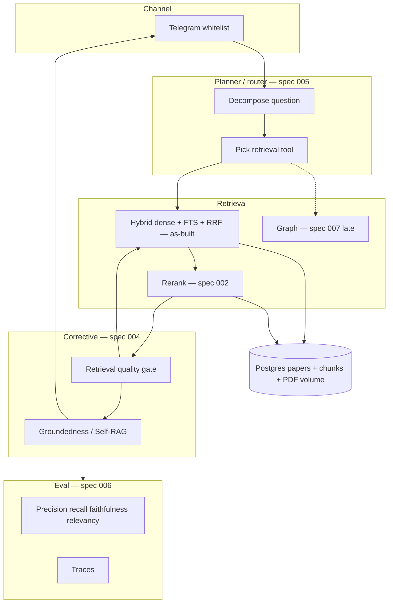
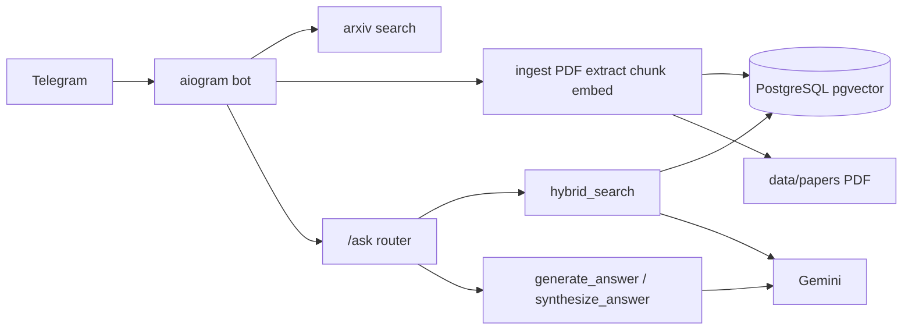
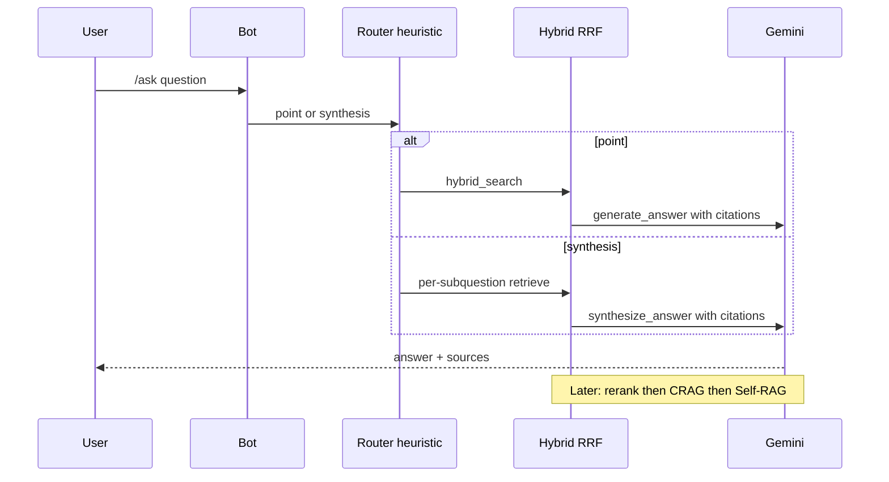
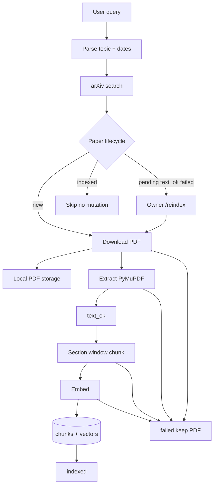
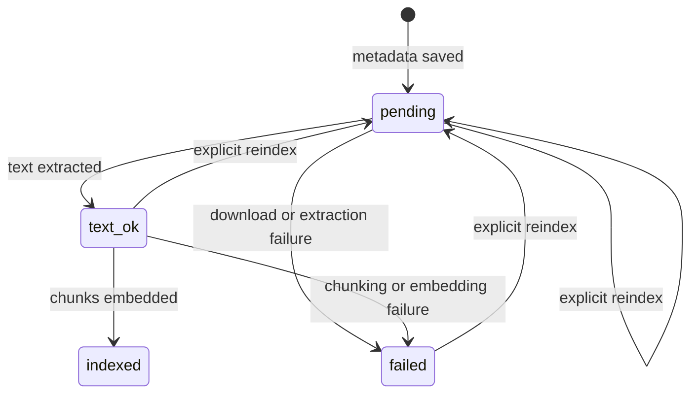
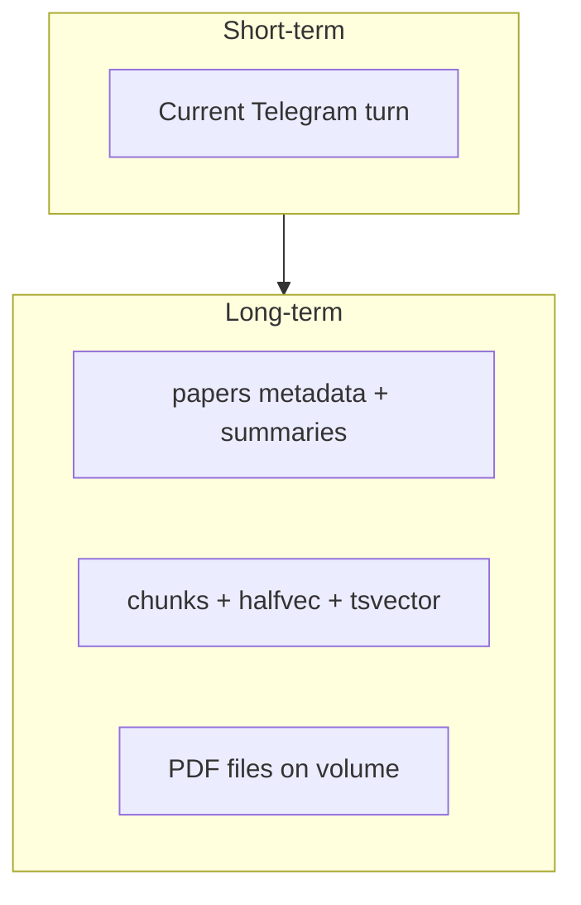
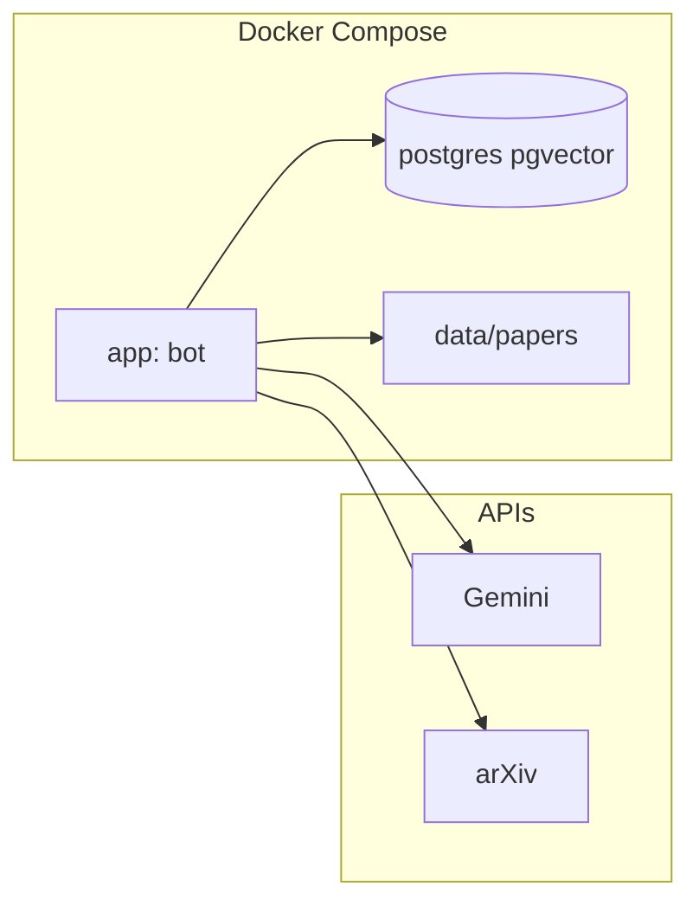
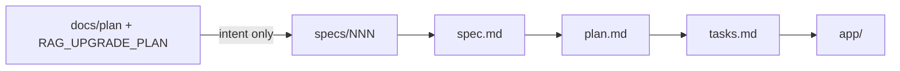

# Architecture Diagrams

Mermaid. Render in GitHub, VS Code, or any Mermaid viewer.

---

## 1. Knowledge Runtime (target)

Solid path today: Telegram -> heuristic route -> hybrid -> generate. Dashed: later specs.

---

## 2. As-built stack

No FastAPI, no LangGraph, no Groq router in the running path.

---

## 3. Ask path (today vs target)

---

## 4. PDF ingest pipeline

---

## 5. Paper lifecycle

`indexed` is terminal for normal search. Replacing an indexed representation needs a
future staged-index design (own spec). Semantic rechunk (`003`) is that class of change.

---

## 6. Memory layers

JSONL backup and LangGraph checkpointer are not wired. Do not draw them as current.

---

## 7. Infrastructure

---

## 8. Spec Kit vs this folder

