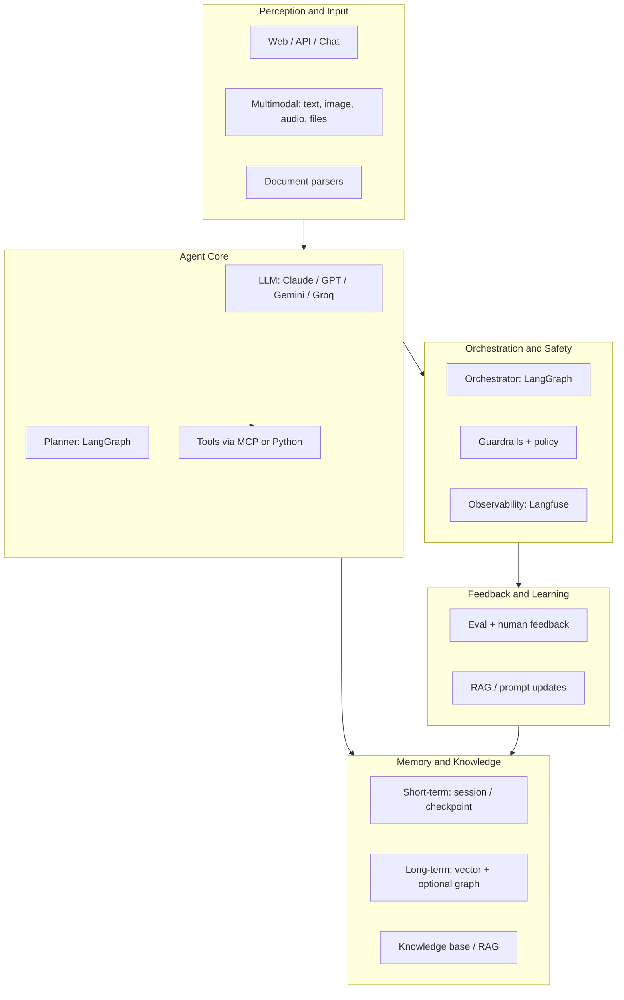
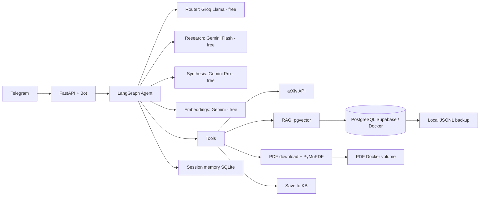
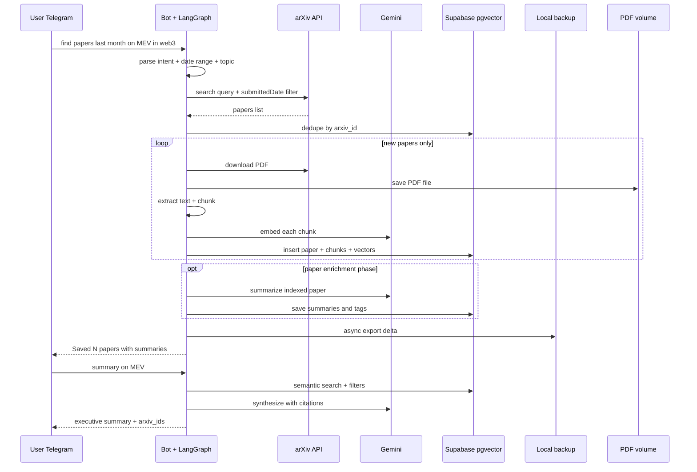
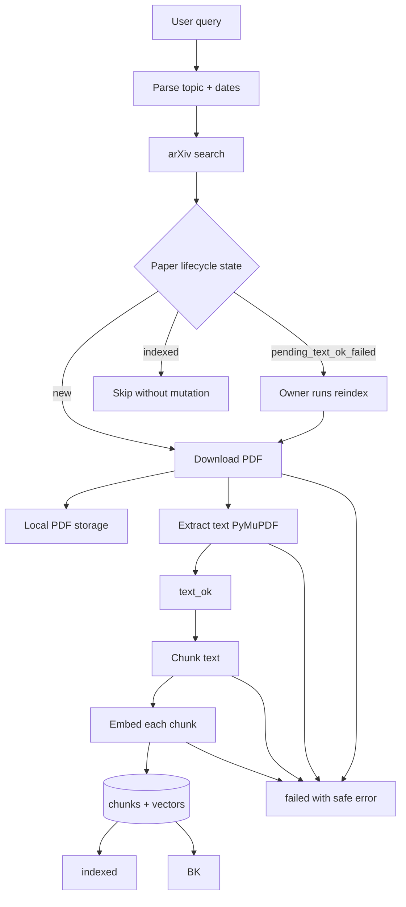
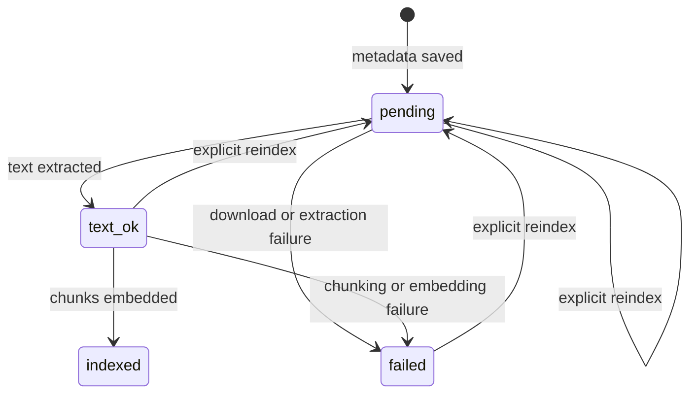
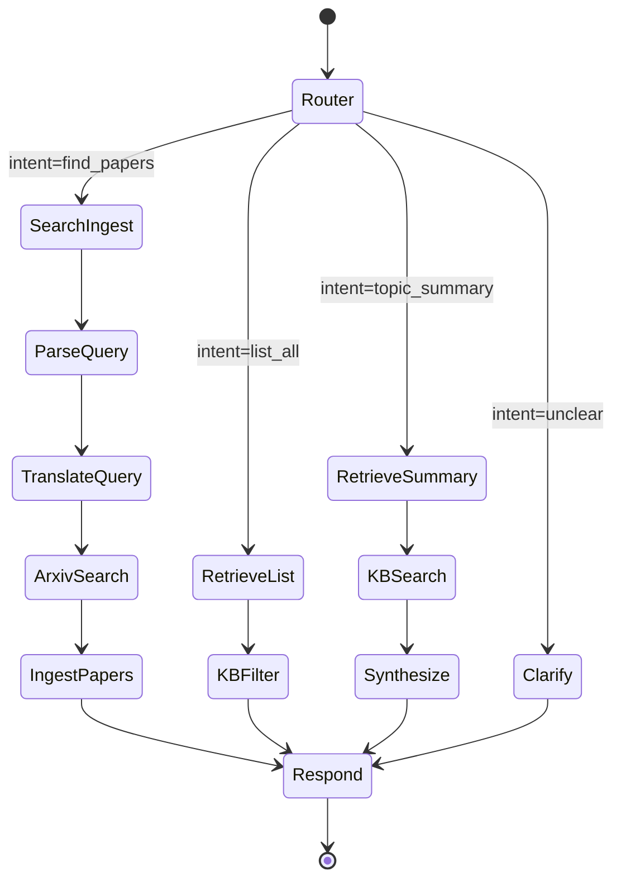
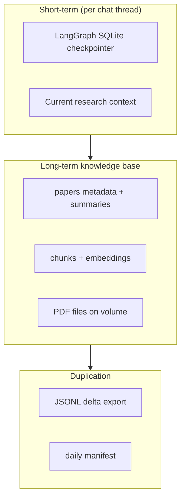
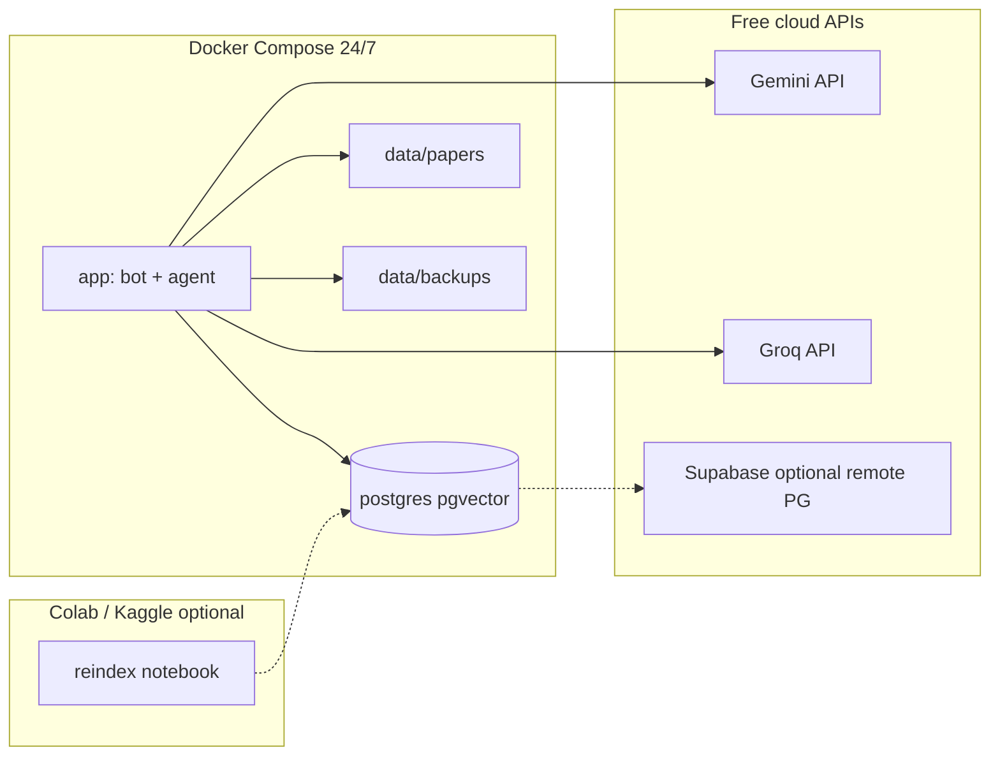
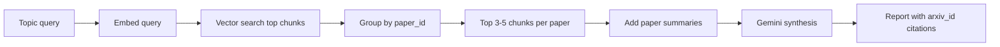

# Architecture Diagrams

All diagrams use Mermaid. Render in GitHub, VS Code, or any Mermaid viewer.

---

## 1. General layered architecture

---

## 2. Research assistant stack (single agent, model routing)

---

## 3. Typical user scenario (sequence)

---

## 4. PDF ingest pipeline

---

## 5. Paper lifecycle

`indexed` is terminal for normal search. Replacing an indexed representation needs a
future staged-index design.

---

## 6. LangGraph state machine (single agent, future phase)

---

## 7. Memory layers

---

## 8. Infrastructure deployment

---

## 9. Summary generation strategy

Recommended for MVP: summaries + top chunks per paper (not full text in one prompt).
