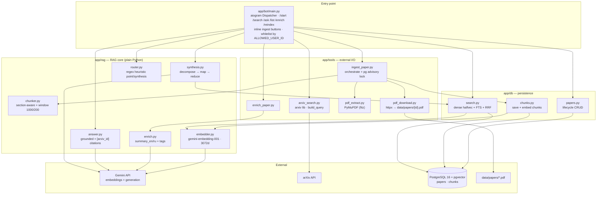

# System overview — the bot as wired today

🇷🇺 [Русская версия](system-overview.ru.md)

Research Helper is a **single-user Telegram bot** that turns arXiv into a personal, searchable
library. It finds recent papers, downloads and indexes their PDFs into PostgreSQL + pgvector, and
answers questions over the indexed fragments with grounded, cited answers. Everything task-specific
is **plain Python functions** — there is no agent framework in the loop yet.

Access is gated to one Telegram user by `ALLOWED_USER_ID`; every handler checks it first.

## The four layers

- **`app/bot/main.py`** — the composition root. An aiogram `Dispatcher` polls Telegram, gates by
  `ALLOWED_USER_ID`, and wires commands to the layers below (via lazy imports inside each handler).
- **`app/tools/`** — everything that touches the outside world: arXiv search
  ([arxiv_search.py](../app/tools/arxiv_search.py)), PDF download over httpx
  ([pdf_download.py](../app/tools/pdf_download.py)), text extraction with PyMuPDF
  ([pdf_extract.py](../app/tools/pdf_extract.py)), and the two orchestrators
  ([ingest_paper.py](../app/tools/ingest_paper.py), [enrich_paper.py](../app/tools/enrich_paper.py)).
- **`app/rag/`** — the RAG core, plain Python: chunking, embeddings, grounded answering, synthesis,
  question routing, and card enrichment.
- **`app/db/`** — persistence: paper lifecycle ([papers.py](../app/db/papers.py)), chunk write +
  embed ([chunks.py](../app/db/chunks.py)), and retrieval ([search.py](../app/db/search.py)).

## Data flow

**Ingest (`/search` → indexed).** `/search <topic>` queries arXiv and saves metadata rows as
`pending`. The user then taps an inline button to ingest a paper: `ingest_paper` takes a per-paper
Postgres advisory lock, downloads the PDF to `data/papers/{arxiv_id}.pdf`, extracts text with
PyMuPDF, section-aware chunks it, embeds every chunk via Gemini, and marks the paper `indexed`.
A successful ingest auto-triggers enrichment (RU/EN summary + tags). The PDF stays on disk even if a
later step fails.

**Ask (`/ask` → grounded answer).** `/ask <question>` is routed by a **regex heuristic**
([router.py](../app/rag/router.py)) into `point` or `synthesis`:

- **point** → `hybrid_search` (dense cosine over `halfvec(3072)` + Postgres full-text, fused with
  RRF) → `generate_answer`, which produces a grounded answer with mandatory `[arxiv_id]` citations.
- **synthesis** → `synthesize_answer`: decompose the question into sub-questions, retrieve per
  sub-question, summarize per paper (map), then produce a cited comparison (reduce).

Retrieval is **ready-only**: `search.py` filters `ingest_status = 'indexed'`, so incomplete papers
never leak into answers. On answer-generation failure the bot falls back to raw retrieved snippets.

## Wired vs vision — read this before trusting a diagram

What is **actually wired today**: aiogram polling bot · plain-Python functions · **Gemini only**
(embeddings + generation) · PostgreSQL + pgvector (`papers`, `chunks`) · local PDF files · hybrid
dense+FTS retrieval with RRF · heuristic `/ask` routing.

What is **not built** (lives in [plan/](plan/README.md) as vision, despite appearing in the older
plan diagrams):

- **No LangGraph agent, no FastAPI** — the bot is direct aiogram handlers over Python functions.
- **No Groq** — the "router" is a regex, not an LLM call; the only external model is Gemini.
- **No `research_sessions` / `chunk_feedback` tables, no JSONL backup** — only `papers` and
  `chunks` exist.
- **No MCP server** — a near-term direction (separate repo), not present here.

When the wiring changes, update this doc and add a `log.md` entry — a diagram that lies about what
is connected is worse than no diagram.

## What it needs to run

- **Env:** `TELEGRAM_TOKEN`, `ALLOWED_USER_ID`, `GEMINI_API_KEY`, `DATABASE_URL` (and optional
  `PAPERS_DIR`).
- **Services:** PostgreSQL 16 + pgvector (Docker Compose), reachable via `DATABASE_URL`; the arXiv
  and Gemini APIs over the network.

Full setup is in [../README.md](../README.md); a dedicated `configuration.md` concept is planned.
