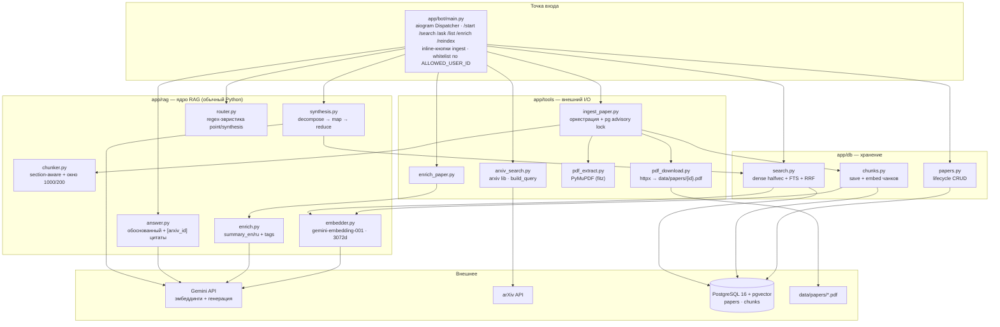

# Обзор системы — бот как собран сегодня

🇬🇧 [English version](system-overview.md)

Research Helper — это **однопользовательский Telegram-бот**, превращающий arXiv в личную
поисковую библиотеку. Он находит свежие статьи, скачивает и индексирует их PDF в PostgreSQL +
pgvector и отвечает на вопросы по проиндексированным фрагментам обоснованными ответами с цитатами.
Всё предметно-специфичное — это **обычные Python-функции**; агентного фреймворка в цикле пока нет.

Доступ ограничен одним Telegram-пользователем через `ALLOWED_USER_ID`; каждый handler проверяет
его первым делом.

## Четыре слоя

- **`app/bot/main.py`** — композиционный корень. aiogram `Dispatcher` поллит Telegram, проверяет
  `ALLOWED_USER_ID` и связывает команды со слоями ниже (через ленивые импорты внутри каждого
  handler'а).
- **`app/tools/`** — всё, что касается внешнего мира: поиск на arXiv
  ([arxiv_search.py](../app/tools/arxiv_search.py)), скачивание PDF через httpx
  ([pdf_download.py](../app/tools/pdf_download.py)), извлечение текста PyMuPDF
  ([pdf_extract.py](../app/tools/pdf_extract.py)) и два оркестратора
  ([ingest_paper.py](../app/tools/ingest_paper.py), [enrich_paper.py](../app/tools/enrich_paper.py)).
- **`app/rag/`** — ядро RAG, обычный Python: чанкинг, эмбеддинги, обоснованные ответы, синтез,
  роутинг вопросов и обогащение карточек.
- **`app/db/`** — хранение: lifecycle статей ([papers.py](../app/db/papers.py)), запись + эмбеддинг
  чанков ([chunks.py](../app/db/chunks.py)) и поиск ([search.py](../app/db/search.py)).
- **`app/mcp_server.py`** — read-only MCP tools (`list_papers`, `get_paper`,
  `search`): stdio по умолчанию, Streamable HTTP с Bearer и rate limit через
  `--http` / Compose-сервис `mcp`.

## Поток данных

**Ingest (`/search` → indexed).** `/search <topic>` запрашивает arXiv и сохраняет строки
метаданных как `pending`. Затем пользователь жмёт inline-кнопку, чтобы проиндексировать статью:
`ingest_paper` берёт per-paper advisory lock в Postgres, скачивает PDF в
`data/papers/{arxiv_id}.pdf`, извлекает текст PyMuPDF, режет section-aware чанки, эмбеддит каждый
чанк через Gemini и помечает статью `indexed`. Успешный ingest автоматически запускает enrichment
(RU/EN резюме + теги). PDF остаётся на диске, даже если поздний шаг упал.

**Ask (`/ask` → обоснованный ответ).** `/ask <question>` роутится **regex-эвристикой**
([router.py](../app/rag/router.py)) в `point` или `synthesis`:

- **point** → `hybrid_search` (dense cosine по `halfvec(3072)` + Postgres full-text, слияние
  через RRF) → `generate_answer`, который даёт обоснованный ответ с обязательными цитатами
  `[arxiv_id]`.
- **synthesis** → `synthesize_answer`: разложить вопрос на подвопросы, retrieval по каждому,
  резюме на статью (map), затем цитируемое сравнение (reduce).

Retrieval **ready-only**: `search.py` фильтрует `ingest_status = 'indexed'`, так что незавершённые
статьи не протекают в ответы. При сбое генерации ответа бот откатывается к сырым сниппетам.

## Wired vs vision — прочитай прежде чем верить диаграмме

Что **реально подключено сегодня**: aiogram polling-бот · read-only MCP
(stdio + token-gated Streamable HTTP) · обычные Python-функции · Gemini
embeddings · DeepSeek V3.2 generation через OpenRouter · PostgreSQL +
pgvector (`papers`, `chunks`) · локальные PDF · hybrid dense+FTS retrieval с RRF.

Что **не собрано** (живёт в [plan/](plan/README.md) как vision, хоть и появляется в старых
плановых диаграммах):

- **Нет LangGraph-агента, нет FastAPI** — бот это прямые aiogram-хендлеры поверх Python-функций.
- **Нет Groq** — «роутер» это regex, не LLM-вызов; единственная внешняя модель — Gemini.
- **Нет таблиц `research_sessions` / `chunk_feedback`, нет JSONL-backup** — существуют только
  `papers` и `chunks`.
- **Нет MCP OAuth / per-user ACL** — на HTTP только shared Bearer; stdio локальный.

Когда проводка меняется — обнови этот док и добавь запись в `log.md`. Диаграмма, которая врёт про
то, что связано, хуже, чем её отсутствие.

## Что нужно для запуска

- **Env:** `TELEGRAM_TOKEN`, `ALLOWED_USER_ID`, `GEMINI_API_KEY`, `DATABASE_URL` (и опц.
  `PAPERS_DIR`).
- **Сервисы:** PostgreSQL 16 + pgvector (Docker Compose), достижимый через `DATABASE_URL`; API
  arXiv и Gemini по сети.

Полная настройка — в [../README.md](../README.md); отдельный концепт `configuration.md`
запланирован.
