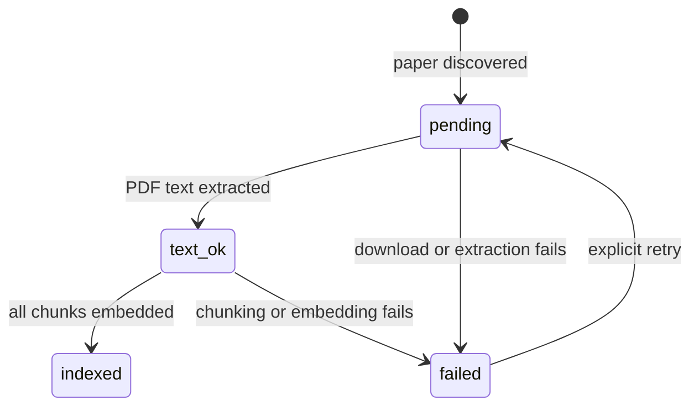

# Data Model: Stabilize RAG Ingest

## Paper

Existing `papers` row. This feature uses existing fields and does not introduce a new
entity.

| Field | Rule |
|---|---|
| `arxiv_id` | Stable unique source identifier. |
| `pdf_local_path` | Set after PDF storage succeeds; retained on later failures. |
| `page_count` | Set after extraction. |
| `text_chars` | Set after extraction. |
| `ingest_status` | Lifecycle state described below. |
| `ingest_error` | Safe diagnostic reason when state is `failed`; cleared on successful retry. |
| `updated_at` | Updated on every lifecycle transition. |

### Lifecycle

Rules:

- `indexed` is terminal for normal topic search.
- Normal topic search must not mutate an `indexed` paper.
- `failed` preserves any existing PDF path.
- `/reindex <arxiv_id>` may move only `pending`, `text_ok`, or `failed` to `pending`.
- `/reindex <arxiv_id>` rejects `indexed`; replacing a working index requires a future
  versioned-index feature.
- Concurrent ingest or reindex of one arXiv ID is prevented by advisory lock; no
  `ingesting` status is introduced in this feature.
- `indexed` means embeddings complete and searchable; summaries/tags are later enrichment.

## Legacy Classification

Before filtering retrieval to `indexed`, classify every paper created by prior
pipeline versions:

| Existing state and chunks | Target state | Required detail |
|---|---|---|
| `text_ok`, at least one chunk, no null embedding | `indexed` | Clear stale error detail. |
| `text_ok`, no chunks or any null embedding | `failed` | Record `legacy incomplete ingest; run /reindex`. |
| `pending` or `failed` | unchanged | Eligible for explicit `/reindex`. |

For current corpus, record before/after evidence for exactly two legacy papers.

## Chunk

Existing `chunks` row.

| Field | Rule |
|---|---|
| `paper_id` | References exactly one paper. |
| `chunk_index` | Stable order within current indexed representation. |
| `text` | Passage used for retrieval. |
| `section` | Best-effort PDF-derived label. |
| `text_hash` | Enables future content-change comparison. |
| `embedding` | Required before parent transitions to `indexed`. |

## Retrieval Eligibility

A chunk is retrievable only when:

1. it has an embedding; and
2. its parent paper has `ingest_status = 'indexed'`.

## Section Evaluation Record

This is a planning artifact, not a persistent database entity for this feature.
For each sampled paper record:

- arXiv identifier;
- category or topic;
- extracted labels and chunk counts;
- expected visible headings;
- false positives and false negatives;
- decision: retain current PDF path or propose LaTeX-first follow-up.
